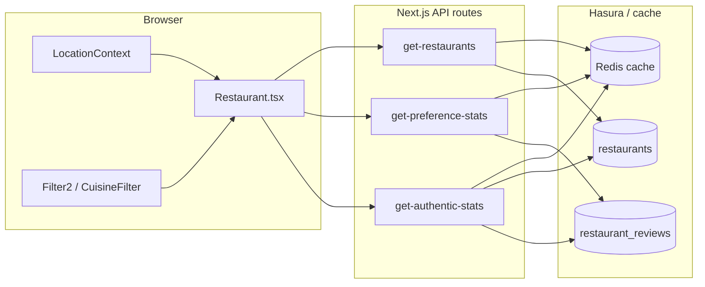

# Restaurant search, filtering, and sorting

Macro-level reference for how the **main restaurant discovery list** (`/restaurants` and related entry points) loads data, narrows it, and orders it. Use this to assess architecture tradeoffs and gaps.

---

#### Scope

| In scope | Out of scope (different flows) |
|----------|--------------------------------|
| `Restaurant` page component and derived list | Individual restaurant detail `/restaurants/[slug]` |
| V2 Hasura list API + supporting stats APIs | WordPress legacy restaurant APIs |
| `Filter2`, `CuisineFilter`, mobile `SearchMenu` / navbar search that **navigate** to `/restaurants` with query params | Hero / navbar modals that only build URLs |

Primary implementation: `src/components/Restaurant/Restaurant.tsx`  
Route shell: `src/app/restaurants/page.tsx` (and `src/app/restaurants/cuisines/[slug]/page.tsx` for cuisine-scoped listing).

---

#### High-level architecture

1. **Fetch**: The client loads **pages** of published restaurants via `restaurantV2Service.getAllRestaurants()` → `GET /api/v1/restaurants-v2/get-restaurants`.  
2. **Transform**: Rows are mapped with `transformRestaurantV2ToRestaurant` (`src/utils/restaurantTransformers.ts`) into the list card shape (`rating` ← `average_rating`, `listedAtMs` ← `published_at` / `created_at`, etc.).  
3. **Filter & sort**: All narrowing and ordering for the **visible grid** (except server `search`) happen **client-side** in a `useMemo` (`displayedRestaurants`).  
4. **Stats**: Optional server endpoints pre-aggregate review data for two sort modes (preference + authentic), cached in Redis.

---

#### Server: list query (`get-restaurants`)

- **Handler**: `src/app/api/v1/restaurants-v2/get-restaurants/route.ts`  
- **GraphQL**: `GET_RESTAURANTS_LIST` in `src/app/graphql/Restaurants/restaurantQueries.ts`  
- **Caching**: Response keyed by query params + Hasura “version” (`getVersion('v:restaurants:all')`), stored via `cacheGetOrSetJSON` (Redis).

**Relevant query parameters**

| Param | Effect |
|-------|--------|
| `limit`, `offset` (or `cursor` when ordering by `created_at`) | Pagination |
| `status` | Typically `publish` |
| `search` | `ILIKE` on `title`, `slug`, `listing_street` |
| `cuisine_ids`, `palate_ids`, `category_ids`, `price_range_id`, `min_rating`, `max_rating`, geo params… | Supported on the route for **future / other callers**; the main listing page **does not pass palate/cuisine IDs from the filter UI today** (see “Gaps” below) |
| `order_by` | Server-side ordering (e.g. `rating`, `created_at`). **The `/restaurants` page does not set this to match the user’s Sort control**; it relies on client reordering after load. |

Default server ordering in the route is generally **`created_at` desc** (stable pagination). **User-facing sort** (Smart, Highest rated, …) is **not** delegated to this API for the main page.

---

#### What counts as “search” today

| Source | Mechanism |
|--------|-----------|
| **URL `listing`** | Becomes `searchTerm` → debounced → passed as `search` to `get-restaurants` (text match on title / slug / street). |
| **Navbar / SearchMenu / Hero** | Build URLs such as `?listing=…`, `?search=…`, `?palates=…`; only what `Restaurant.tsx` reads affects load (`listing` drives API `search`; `palates` / `ethnic` seed **filter state**, not the list API). |
| **Address URL param** | Initialized into `searchAddress` for **client** address relevance filter + optional keyword-based sort helper (`restaurantService.sortRestaurantsByLocation`). |

---

#### Client-side filtering (`displayedGuests` pipeline)

Order of operations in `displayedRestaurants` (conceptually):

1. **MY_PREFERENCE**: attach `searchPalateStats` per row from `preferenceStats` (see below).  
2. **Cuisine route** (`cuisineSlug` + `filters.cuisine`): keep rows whose `listingCategories` match the slug / selected cuisines.  
3. **Price** (`filters.price`): substring match on `priceRange` string (display name).  
4. **Min rating** (`filters.rating`): `restaurant.rating >= threshold`.  
5. **Address keyword** (`searchAddress`): `restaurantService.calculateLocationRelevance(...) > 0`.  
6. **Location context** (`selectedLocation` from `LocationContext`): `applyLocationFilter(list, selectedLocation, 100)` — **filters out** rows that don’t meet the location threshold; it does **not** sort by location anymore.  
7. **Sort**: `sortRestaurants(...)` (see next section).

**Palate / region selection** (`filters.palates` from `Filter2`, URL `palates` / `ethnic`): state is kept for **Filter2**, **suggested restaurants**, and **preference** sort input, but there is **no** step that removes rows from the main grid by matching `filters.palates` to each restaurant’s cuisines/palates. The **get-restaurants** route could filter by `palate_ids`, but the current page **does not pass** those IDs.

---

#### Client-side sorting (`sortRestaurants`)

Implemented in `Restaurant.tsx`. If `searchAddress` is set, the list is first passed through `restaurantService.sortRestaurantsByLocation` (keyword/tie behavior), then sorted with the chosen mode:

| UI label (`Filter2` key) | Logic (tie-breakers in parentheses) |
|--------------------------|-------------------------------------|
| **My Preference** | `searchPalateStats.avg` desc (count, overall rating, review count) |
| **Smart Sort** (`SMART`) | Authentic avg from `get-authentic-stats` desc (authentic count, overall rating, review count, recognition) |
| **Highest Rated** (`DESC`) | `rating` asc/desc |
| **Lowest Rated** (`ASC`) | |
| **Newest** (`NEWEST`) | `listedAtMs` desc (`published_at` / `created_at`), then `databaseId` desc |

- **Null / unset `sortOption`**: Logged-in users with profile palates get `MY_PREFERENCE` via `useEffect`; others effectively fall through to **SMART** behavior in the comparator.  
- **`MY_PREFERENCE` visibility**: Hidden in `Filter2` when `canUsePreferenceSort` is false (`userPreferencePalates.length === 0`).

Supporting fetches:

- **`GET /api/v1/restaurants-v2/get-preference-stats?palates=...`**: Map `restaurant_uuid → { avg, count }` for reviews whose review palates overlap the **user’s** profile palates. Cached (Redis + reviews version).  
- **`GET /api/v1/restaurants-v2/get-authentic-stats`**: Map `uuid → { avg, count }` for **authentic** definition: reviews where reviewer palates overlap the restaurant’s **palates + cuisines** JSON (aligned with `calculateAuthenticRating` conceptually). Cached; bounded batch sizes on reviews/restaurants (see route comments).

---

#### Pagination and “global” sort

- Pages are accumulated in React state (`restaurants`); infinite scroll loads the next offset chunk.  
- **Sort is applied to whatever rows are currently loaded**, not the entire database. Perfect global ordering would require **server-side `order_by` matching the selected mode** (or loading all IDs), which is **not** implemented for the main page today.

---

#### Related UI modules

| Module | Role |
|--------|------|
| `src/components/Filter/Filter2.tsx` | Sort popover; opens Price & Rating modal; wires `onFilterChange` (debounced ~300ms). Desktop cuisine uses `CuisineFilter`. |
| `src/components/Filter/CuisineFilter.tsx` + `CuisinePillSelector.tsx` | Palate/cuisine pill UI shared with `SearchMenu`. |
| `src/components/layout/SearchMenu.tsx` | Mobile full-screen search; location sheet; navigates to `/restaurants` with query string. |
| `src/components/navigation/NavbarSearchBar.tsx` | Desktop search; palate modal; navigates with `search` / `palates` params. |
| `src/utils/locationUtils.ts` | `applyLocationFilter`, `getLocationRelevance` (used for address **filter** / relevance scoring elsewhere; **not** used as primary list sort after the location-vs-sort fix). |

---

#### Gaps and design notes (for assessment)

1. **Palate filter**: UI state + API capability exist, but **main grid is not narrowed by selected palate slugs**; only the cuisine **slug route** filters by `listingCategories`.  
2. **Server vs client sort**: Server returns a default order; **user sort reorders only the loaded window**.  
3. **Price filter**: Client string match on display name — fragile if copy changes.  
4. **Authentic / preference stats**: Approximate, capped review/restaurant batch sizes; good for product, not audit-grade analytics.  
5. **`listing` URL cleanup**: `Restaurant.tsx` removes `listing` from URL after read in one `useEffect` — behavior to be aware of for deep links.

---

#### File index

| Concern | Path |
|---------|------|
| List page orchestration | `src/components/Restaurant/Restaurant.tsx` |
| List → card model | `src/utils/restaurantTransformers.ts` |
| Hasura list query | `src/app/graphql/Restaurants/restaurantQueries.ts` (`GET_RESTAURANTS_LIST`) |
| List API | `src/app/api/v1/restaurants-v2/get-restaurants/route.ts` |
| Preference stats API | `src/app/api/v1/restaurants-v2/get-preference-stats/route.ts` |
| Authentic stats API | `src/app/api/v1/restaurants-v2/get-authentic-stats/route.ts` |
| V2 client service | `src/app/api/v1/services/restaurantV2Service.ts` |
| Location filtering | `src/utils/locationUtils.ts` |
| Older search write-up | `documentation/SEARCH_ALGORITHM.md` |

---

*Last updated to reflect the codebase layout and client/server split; adjust if `get-restaurants` query params or `displayedRestaurants` pipeline change.*
