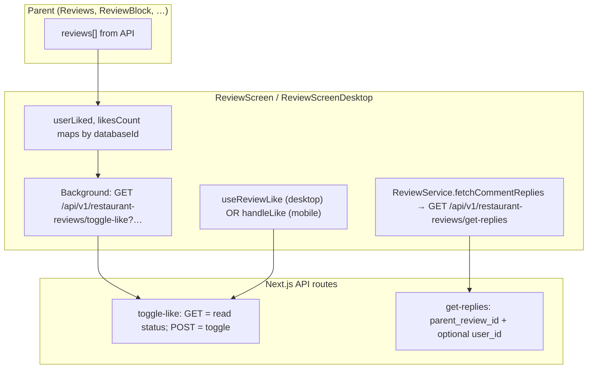

# Reviews full-screen viewer: data flow, likes & comments

This document describes how **`ReviewScreen`** (mobile / &lt;768px) and **`ReviewScreenDesktop`** (desktop) work end-to-end: where review data comes from, how the like button and comment UI load data, and why perceived latency can differ from “instant” SNS apps. Use it for performance investigations and refactors.

---

## 1. Component roles

| Component | File | When it renders |
|-----------|------|-----------------|
| **ReviewScreen** | `src/components/review/ReviewScreen.tsx` | Mobile: vertical scroll of posts, comments often behind **CommentsBottomSheet** or inline preview. |
| **ReviewScreenDesktop** | `src/components/review/ReviewScreenDesktop.tsx` | Desktop: horizontal carousel-style viewer with comments panel open by default (`showComments: true`). |

Both receive the same props shape at the boundary:

- `reviews: GraphQLReview[]` — full review objects passed from the parent.
- `initialIndex: number` — which review is focused when the viewer opens.
- `isOpen`, `onClose` — modal / overlay lifecycle.

**ReviewScreen** additionally supports `onLoadMore`, `hasNextPage`, `onActiveIndexChange` for infinite scroll in long feeds.

---

## 2. Where the viewer is mounted (entry points)

The viewer is **not** routed; it is a **client overlay** (often via `createPortal` to `document.body`). Typical parents:

| Parent | Path | Notes |
|--------|------|--------|
| **Reviews** (homepage feed) | `src/components/review/Reviews.tsx` | Passes `currentReviews` as `GraphQLReview[]`, `viewerIndex`, `viewerOpen`. |
| **ReviewCard2** | `src/components/review/ReviewCard.tsx` | Opens viewer from a card grid. |
| **ReviewBlock** | `src/components/review/ReviewBlock.tsx` | Single-review modal: `reviewsArray = [reviewData]`. |
| **Profile ReviewsTab** | `src/components/Profile/ReviewsTab.tsx` | User’s reviews. |
| **Photos** (restaurant) | `src/components/Restaurant/Details/Photos.tsx` | Gallery-driven open. |
| **reviews/viewer** | `src/app/reviews/viewer/page.tsx` | Dedicated viewer page. |

**Responsive split:** parents usually choose `ReviewScreen` vs `ReviewScreenDesktop` with `window.innerWidth < 768` (see `ReviewBlock.tsx`) or a shared `useIsMobile` pattern in `Reviews.tsx`.

---

## 3. Data shape: what the feed already has

Reviews originate from **V2 APIs** (e.g. `reviewV2Service.getAllReviews`, `get-reviews-by-restaurant`) and are transformed to **`GraphQLReview`** in `src/utils/reviewTransformers.ts`.

Relevant fields for engagement:

- **`id`** — UUID string for Hasura `restaurant_reviews` (required for V2 like/reply APIs).
- **`databaseId`** — numeric hash used as a **React key** and in several `Record<number, …>` maps (likes, counts). **Not** the DB primary key for mutations.
- **`commentLikes`** — in list/card code, often used as **like count** on the review (naming is legacy; it is not “comment count only”).
- **`userLiked`** — whether the current user liked the review, when the feed API populated it.
- **`author`**, **`reviewImages`**, **`palates`** — for display.

If the feed **does not** include fresh `likes_count` / `user_liked`, the viewer **fixes state in the background** (see §5).

---

## 4. High-level architecture

---

## 5. Like button: state machine

### 5.1 Initial state (on `reviews` change)

- **`ReviewScreenDesktop`** (`useEffect` on `reviews`): seeds `userLiked[databaseId]` from `review.userLiked`, and `likesCount[databaseId]` from `review.commentLikes` (parsed as number).
- **`ReviewScreen`**: same for `userLiked`; `likesCount` is set from `review.commentLikes` in a `setLikesCount` merge.

So the **first paint** uses **feed snapshot** only. If the feed is stale or wrong, the UI may briefly show incorrect counts until sync completes.

### 5.2 Background sync (after paint, logged-in users)

Both screens run an effect when the viewer is open:

- **Desktop:** syncs **only the current review** (`currentIndex`): `GET /api/v1/restaurant-reviews/toggle-like?review_id=…&user_id=…` with `Authorization: Bearer <Nhost token>`.
- **Mobile:** syncs **initialIndex ± 1** (three reviews) with the same GET.

The route **GET** handler is **read-only**: it returns `{ liked, likesCount }` from Hasura (`restaurant_review_likes` + `restaurant_reviews.likes_count`). See `src/app/api/v1/restaurant-reviews/toggle-like/route.ts`.

A **30s in-memory cache** (`likeStatusCacheRef`, key `${reviewId}_${userId}`) avoids repeated GETs for the same pair.

**Why this can feel slow:** first open still waits for **N+1 network** (user id resolution + token + HTTP). There is **no** server-side push; everything is pull-based.

### 5.3 Toggling a like

**Desktop (current review only):** uses **`useReviewLike`** (`src/hooks/useReviewLike.ts`):

- `reviewId` = review UUID string.
- **Optimistic UI:** flips `isLiked` and `likesCount` immediately, then `POST` via **`reviewV2Service.toggleLike`** → `POST /api/v1/restaurant-reviews/toggle-like` with JSON `{ review_id, user_id }`.
- Short cooldown (`LOADING_COOLDOWN_MS = 220`) to avoid double taps.
- `onConfirm` updates parent maps so the list stays in sync.

**Mobile:** **`handleLike`** in `ReviewScreen.tsx` (inline) does the same optimistic pattern and calls **`reviewV2Service.toggleLike`** for UUID ids, or legacy **`reviewService.likeComment` / `unlikeComment`** for non-UUID ids.

**Rate limiting:** POST toggle-like is rate-limited per user (Redis), see `toggle-like/route.ts`.

---

## 6. Comments: loading and counts

### 6.1 API

All replies go through **`ReviewService.fetchCommentReplies`** (`src/services/Reviews/reviewService.ts`):

- For **UUID** parent review ids: **`GET /api/v1/restaurant-reviews/get-replies?parent_review_id=<uuid>&user_id=<uuid optional>`**
- Returns `result.data` as an array of reply rows (with like state when `user_id` is passed).

There is **no lightweight “count only” endpoint** in this path: **comment count is computed as `replies.length` after a full fetch**.

### 6.2 ReviewScreenDesktop

1. **Comment count badge:** For each **visible** index (`currentIndex ± ~2`, `visibleIndices`), an effect calls **`fetchCommentReplies(review.id)`** without `userId` **only to get `length`**. That is **one full reply list per visible review** just to count.
2. **Comment thread:** When `showComments` is true and the review changes, it loads **`fetchCommentReplies(review.id, userId)`** again with `userId` to hydrate per-reply `userLiked` / reply likes.

So the same data may be requested **twice** (count path vs full thread path) for the active review.

### 6.3 ReviewScreen (mobile)

1. **`fetchFirstCommentForReview`** — loads **full** `fetchCommentReplies` for “preview” and sets `commentCounts[databaseId] = replies.length`. Runs for initial + adjacent posts and via **IntersectionObserver** when posts scroll into view.
2. **CommentsBottomSheet** — when opened, uses `fetchCommentReplies` again for the selected review.

### 6.4 Comment / reply likes

Handled in-component with **`replyLikes`**, **`replyUserLiked`**, **`replyLikeLoading`** maps; toggles call **`reviewV2Service.toggleLike`** with the **reply UUID** (same endpoint as review likes).

---

## 7. Other parallel work (competition for the main thread & network)

- **Follow button:** `check-follow-status` POST per author when index changes (with context + 5 min cache).
- **Image preload:** `ReviewScreenDesktop` debounces image preload by **100ms** (`setTimeout`).
- **Spring / scroll:** `ReviewScreenDesktop` uses `@react-spring/web` + wheel gestures for carousel motion.
- **Windowed rendering:** Desktop only renders a **subset** of reviews around `currentIndex` (performance).

---

## 8. Why “SNS-fast” feels hard to match

| Factor | Current behavior | Typical fast SNS pattern |
|--------|------------------|-------------------------|
| **Like count on open** | Feed fields + optional GET sync per review | Denormalized count on feed payload; optional WebSocket |
| **Comment count** | Full `get-replies` list, then `.length` | `replies_count` column on review or cheap aggregate |
| **Double fetch** | Count fetch + thread fetch can duplicate work | Single request or shared cache (SWR/React Query) |
| **Sync timing** | `setTimeout(..., 0)` / `setTimeout` 100ms debounce defers work | Critical path minimized; skeletons |
| **Auth** | Repeated `getNhostToken()` / `getUserUuid()` per action | Cached session + single id resolution |

---

## 9. File reference (quick lookup)

| Concern | File |
|---------|------|
| Mobile viewer | `src/components/review/ReviewScreen.tsx` |
| Desktop viewer | `src/components/review/ReviewScreenDesktop.tsx` |
| Like hook | `src/hooks/useReviewLike.ts` |
| V2 like POST | `src/app/api/v1/services/reviewV2Service.ts` → `toggleLike` |
| Like route (GET + POST) | `src/app/api/v1/restaurant-reviews/toggle-like/route.ts` |
| Replies fetch (client) | `src/services/Reviews/reviewService.ts` → `fetchCommentReplies` |
| Bottom sheet comments | `src/components/review/CommentsBottomSheet.tsx` |
| Feed wiring | `src/components/review/Reviews.tsx`, `ReviewCard.tsx`, `ReviewBlock.tsx` |

---

## 10. Improvement directions (for assessment / backlog)

1. **Include `likes_count` and `user_liked` (or equivalent) in every feed query** so the viewer does not need a GET sync on open when data is fresh.
2. **Add `replies_count` (or denormalized comment count) on `restaurant_reviews`** and return it from list APIs — avoid `get-replies` **only** for counting.
3. **Deduplicate** desktop “count” vs “full thread” into one **cached** request (e.g. React Query key `['replies', reviewId]`).
4. **Unify** mobile `handleLike` vs desktop `useReviewLike` to one code path to reduce drift.
5. **Clarify naming** in `GraphQLReview`: `commentLikes` is misleading if it stores **review** like counts.

---

*Last updated to match the codebase layout in `tastyplates-v2-1` (ReviewScreen / ReviewScreenDesktop, toggle-like, get-replies, reviewService).*
